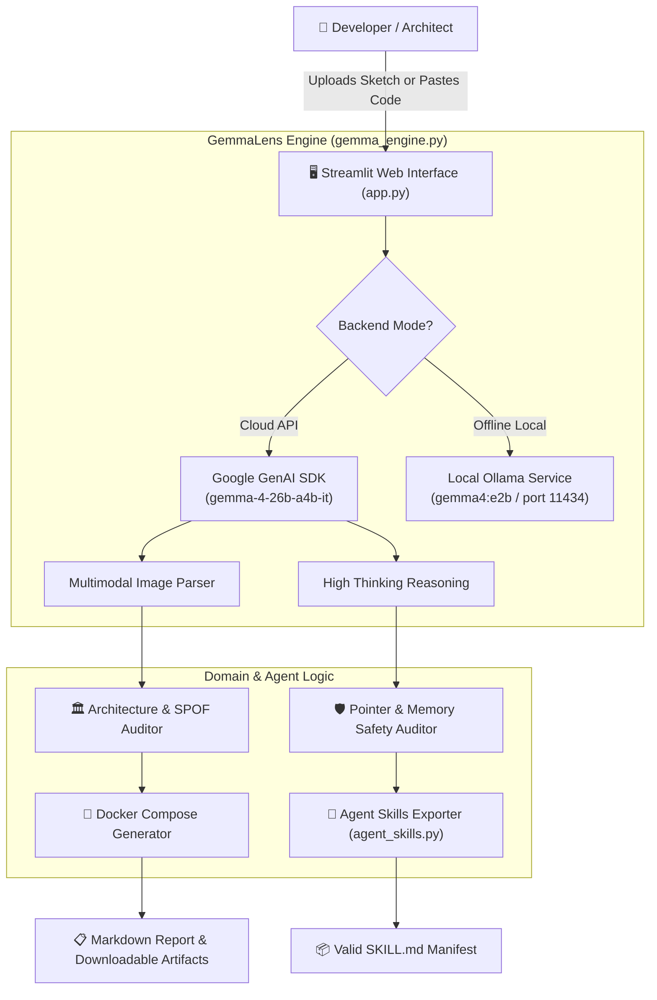

# GemmaLens

> An open-source multimodal developer copilot powered by Google Gemma 4 (26B MoE) and local Ollama, auditing architecture sketches for single points of failure, verifying low-level code memory safety, and generating standard-compliant Agent Skills.

## Team

**Team Name:** GemmaLens

| Member | Contribution |
| ------ | ------------ |
| Dhanwinn | Team Lead, Project Architecture, Apache-2.0 Licensing, Environment Setup |
| Avanish Ayyappan | AI Engine Architecture, Gemma 4 MoE API Integration, Local Ollama Fallback Engine |
| Shasank Paruchuri | Domain Prompt Engineering, Security Reasoning Guidelines, Agent Skills Standard Exporter |
| Gyatchut | Interactive Streamlit Dashboard, Multimodal Visualization, Audit Report Generator |

## Problem Statement

### The Problem
During software development and system design sprints, engineers spend significant time whiteboarding architectures, drawing cloud topologies, and reviewing low-level systems code. Manual audits often overlook subtle architectural bottlenecks (e.g., missing message queue buffers, database single points of failure) and low-level memory hazards (buffer overruns, pointer aliasing, dangling references). Furthermore, closed-source cloud AI solutions introduce privacy concerns for proprietary diagrams and incur steep API costs.

### Why We Chose This Problem
We chose this problem to demonstrate how modern **open-weight foundation models**—specifically Google's **Gemma 4**—can deliver enterprise-grade visual reasoning and deep logical static analysis on open infrastructure, running either in the cloud or completely offline on developer machines.

## Solution
GemmaLens provides an end-to-end multimodal auditing copilot that ingests visual diagrams, applies multi-step thinking to detect system flaws, generates runnable infrastructure (Docker Compose), verifies C/C++/Rust memory safety, and exports reusable Agent Skills conforming to the [Agent Skills open standard](https://agentskills.io/specification).

### Key Features
- **Visual Architecture & Topology Ingestion:** Parses whiteboard sketches, handwritten flowcharts, and cloud topologies using Gemma 4 multimodal vision.
- **Deep-Thinking Code Verification:** Uses Gemma 4 internal reasoning (`thinking_level="high"`) to perform static analysis on pointer arithmetic, concurrency, and memory bounds.
- **Automated Infrastructure Scaffolding:** Converts topology drawings directly into resilient, runnable Docker Compose manifests.
- **Dual Inference Engine:** Seamlessly toggles between hosted Google Gemini API (`gemma-4-26b-a4b-it`) and 100% offline local inference via **Ollama** (`gemma4:e2b`).
- **Agent Skills Standard Exporter:** Directly packages auditing workflows into portable `SKILL.md` specifications complying with `agentskills.io`.

## Innovation and Differentiation
Unlike traditional generic chat interfaces or closed-source platforms, GemmaLens:
1. **Meaningfully Combines Multimodal + Thinking:** Uses visual perception to read architecture diagrams and deep reasoning mode to verify mathematical and pointer bounds.
2. **Offers Full Offline Autonomy:** Developers can run the tool 100% locally with Ollama without sending proprietary code to third parties.
3. **Adheres to Open Agent Standards:** Emits exportable Agent Skills that open-source autonomous agent frameworks (like OpenCode and Antigravity) can load and execute.

## Technical Implementation

### Architecture



### Technology Stack

| Category | Technologies |
| -------- | ------------ |
| Frontend | Streamlit 1.65, HTML5/CSS3 Custom Badges |
| Backend | Python 3.14, Google GenAI SDK (`google-genai`), Requests |
| Database | N/A (Stateless / Local Artifact Generation) |
| AI / ML | Google Gemma 4 (26B MoE `gemma-4-26b-a4b-it`), Ollama (`gemma4:e2b`) |
| Infrastructure | DigitalOcean App Platform / Localhost |
| APIs / Services | Google AI Studio Gemini API, Local Ollama REST API |

### How It Works
1. **Input Stage:** The user uploads an image of an architecture sketch or inputs a code snippet in the Streamlit UI.
2. **Inference Dispatch:** `gemma_engine.py` routes the payload. For visual diagrams, it registers the media via the Google GenAI File API and sets `thinking_level="high"`.
3. **Reasoning & Synthesis:** Gemma 4 decomposes the architecture, finds missing failovers/caches, and drafts a Docker Compose file.
4. **Agent Skill Packaging:** `agent_skills.py` formats the execution steps into an open-standard `SKILL.md` file ready for distribution.

### Technical Decisions
- **Mixture-of-Experts (MoE) Selection:** We chose `gemma-4-26b-a4b-it` because its 4B active parameter profile gives sub-second token generation while retaining 26B-scale reasoning depth.
- **Dual-Engine Architecture:** Adding the local Ollama fallback guarantees that teams can continue working and demoing even during network outages at hackathon venues.

## Implementation During the Hackathon

The entire GemmaLens project was designed, implemented, and verified during Hacktoberfest Hack Day Coimbatore 2026.

### Team Contributions

- **Dhanwinn:** Repository initialization, Apache-2.0 license integration, environment documentation, dependency management, and OrganizerHQ coordination.
- **Avanish Ayyappan:** Implemented `gemma_engine.py`, Google GenAI SDK integration with thinking mode, retry handling for unstable Wi-Fi, and Ollama offline support.
- **Shasank Paruchuri:** Designed specialized auditing prompts (`prompts.py`), implemented the Agent Skills open standard exporter (`agent_skills.py`), and created the `SKILL.md` manifest.
- **Gyatchut:** Designed the multi-tab Streamlit dashboard (`app.py`), implemented file upload flows, visual feedback, live report rendering, and artifact downloaders.

## Working Application

**Live Application:** Deployed locally at `http://localhost:8501` (and deployable to DigitalOcean App Platform using the Hacktoberfest credit).

The application allows users to:
1. Ingest architecture diagrams and get Single Point of Failure (SPOF) reports.
2. Test code snippets for pointer safety and memory leaks.
3. Generate and download validated `SKILL.md` packages.

## Demo Video

**Demo Video:** [Demo Video Link / Walkthrough]

A recorded walkthrough demonstrates uploading a sample architecture topology, viewing Gemma 4's multi-step thinking breakdown, and downloading the generated Docker Compose file.

## Open Source and AI Usage

### AI / Models

- **Google Gemma 4 (`gemma-4-26b-a4b-it`):** Open-weight Mixture-of-Experts foundation model developed by Google DeepMind. Used for visual diagram analysis, deep thinking, and code refactoring. Released under the Apache 2.0 open-weight license.
- **Ollama Gemma 4 (`gemma4:e2b`):** Lightweight open model used for local offline inference.

### Open Source Components

- **Streamlit (`streamlit`):** Open-source Python framework for developer dashboards (Apache 2.0).
- **Google GenAI SDK (`google-genai`):** Official SDK for hosted Gemini and Gemma model APIs (Apache 2.0).
- **Pillow (`PIL`):** Python Imaging Library for handling diagram formats (HPND License).
- **Agent Skills Standard:** Open specification from `agentskills.io` for packaging reusable AI workflows.

## Setup and Usage

### Prerequisites

- Python 3.10 or higher
- A free Google AI Studio API key from [aistudio.google.com/apikey](https://aistudio.google.com/apikey)
- *(Optional for offline mode)* [Ollama](https://ollama.com/) installed and running

### Installation

```bash
git clone https://github.com/miriyaladhanwinn/GemmaLens.git
cd GemmaLens
pip install -r requirements.txt
```

### Environment Variables

Copy the example configuration:
```bash
cp .env.example .env
```
Fill in your credentials:
```env
GEMINI_API_KEY=your_google_ai_studio_api_key_here
OLLAMA_BASE_URL=http://localhost:11434
OLLAMA_MODEL=gemma4:e2b
```

### Running the Project

```bash
streamlit run app.py
```

### Usage

1. Open your browser to `http://localhost:8501`.
2. Enter your API key in the sidebar (or toggle to Local Ollama mode).
3. Switch to the **Architecture & Diagram Auditor** tab and upload any architecture image.
4. Click **Audit Architecture with Gemma 4** to generate the audit report and Docker Compose.
5. Switch to the **Agent Skills Studio** tab to export a standard-compliant `SKILL.md`.

## Devpost Submission

**Devpost / OrganizerHQ Project:** [Hacktoberfest Hack Day Coimbatore Submission Link]

## Credits and License

### Credits
- **Major League Hacking (MLH)** for hosting Hacktoberfest Hack Day.
- **INIT Club & iDEA Club** at Amrita Vishwa Vidyapeetham for organizing.
- **Google DeepMind** for the Gemma 4 open-weight model family.
- **DigitalOcean & SkySync** for developer credits and event support.

### License

This project is open-source software licensed under the **[Apache License 2.0](LICENSE)**.

## Submission Checklist

- [x] Project title and description added
- [x] All team members listed
- [x] Problem clearly explained
- [x] Reason for choosing the problem explained
- [x] Solution and key features documented
- [x] Innovation and differentiation explained
- [x] Architecture included with Mermaid diagram
- [x] Technical implementation documented
- [x] Work completed during the hackathon documented
- [x] Team contributions documented
- [x] Working application is functional
- [x] Live application link added where applicable
- [x] Demo video added / prepared
- [x] AI and open-source components documented
- [x] Setup and usage instructions tested
- [x] Challenges and learnings documented
- [x] Credits added
- [x] License added (Apache-2.0)
- [x] Repository is organized and complete
