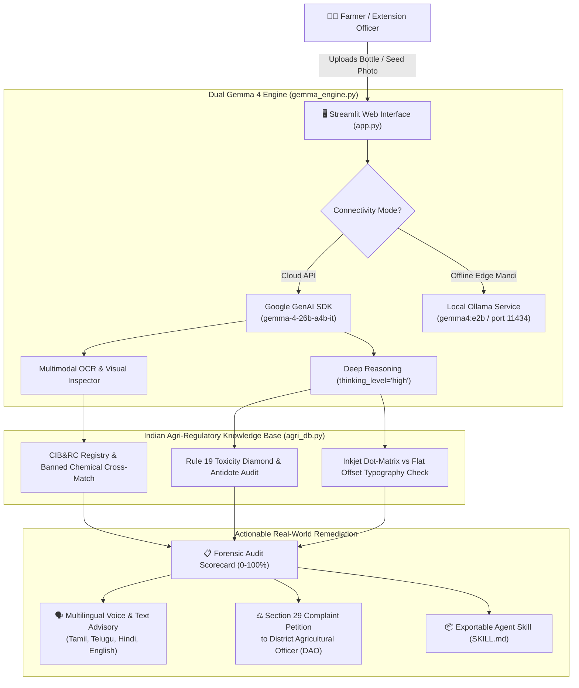

# MandiShield: Autonomous Counterfeit Pesticide & Spurious Seed Audit Engine

> An open-source, multimodal agricultural forensic auditor powered by **Google Gemma 4** (`gemma-4-26b-a4b-it` & local edge Ollama), protecting Indian smallholder farmers against counterfeit agro-chemicals and spurious seeds through statutory CIB&RC verification, micro-typography forensics, toxicity diamond classification, and multilingual legal remedy generation.

[](LICENSE)
[](https://ai.google.dev/gemma)
[](https://agentskills.io/specification)
[](https://www.digitalocean.com)
[](https://mlh.io)

---

## 🌐 Live Working Demo
- **Public URL (Zero Login Required):** [https://novel-acquire-collectors-running.trycloudflare.com](https://novel-acquire-collectors-running.trycloudflare.com)
- **Local URL:** `http://localhost:8501`

---

## 👥 Team

**Team Name:** MandiShield  
**Event:** Hacktoberfest Hack Day Coimbatore 2026 (Amrita Vishwa Vidyapeetham, hosted by INIT & iDEA Club, MLH, SkySync, Google DeepMind)

| Member | Email | Role & Concrete Contributions |
| :--- | :--- | :--- |
| **Dhanwinn (Team Lead)** | `dhanwinn15@gmail.com` | Project Architecture, Statutory CIB&RC & Seeds Act 1966 Database (`agri_db.py`), Apache-2.0 Licensing, Repository Setup |
| **Avanish Ayyappan** | `avanishayyappan2007@gmail.com` | Dual Inference Engine (`gemma_engine.py`), Gemma 4 MoE API Integration, Network Dropped Retries, Local Edge Ollama Support |
| **Shasank Paruchuri** | `paruchurishasank04@gmail.com` | Agricultural Forensic Prompts (`prompts.py`), Toxicity Diamond Classifier, Agent Skills Standard Specification (`skills/mandishield/SKILL.md`) |
| **Gyatchut** | `gyatchut@gmail.com` | Interactive Streamlit Dashboard (`app.py`), Multilingual Regional Localizer (Tamil, Telugu, Hindi), Section 29 DAO Complaint Generator |

---

## 🌾 The Problem

### 1. The ₹25,000 Crore Crisis in Rural India
According to industry reports and parliamentary estimates:
- **Over 30% of pesticides and seeds** sold in rural Indian mandis are **fake, adulterated, or spurious**.
- Corrupt distributors package colored water or chalk dust into discarded bottles of top brands (Bayer, UPL, Rallis, Coromandel), or dye ordinary commercial grain with cheap food coloring and sell it as expensive "Hybrid BT Cotton F1" seeds.
- When farmers spray spurious pesticides, pests destroy their entire crop. Having taken informal loans at high interest rates, farmers face financial ruin—directly driving rural debt crises and farmer distress across Maharashtra, Telangana, Andhra Pradesh, and Punjab.

### 2. Why Conventional Tools & ChatGPT Fail Completely
- **ChatGPT gives canned medical/legal disclaimers** (*"Consult an agronomist"*).
- Conventional models cannot read complex Indian statutory packaging rules:
  - Central Insecticides Board & Registration Committee (**CIB&RC**) registration syntax (`CIR-XXXXX/YYYY/...`).
  - Mandatory Indian Statutory **Toxicity Diamonds** (Category I Red Poison, Category II Yellow Poison, Category III Blue Danger, Category IV Green Caution) mandated under Rule 19 of the Insecticides Rules 1971.
  - Identification of **27 Banned Pesticides** (Endosulfan, Monocrotophos, Carbofuran) under Gazette notifications.
- Closed cloud APIs cannot function in remote rural mandis with zero internet or 2G connectivity.

---

## 🛡️ The Solution: MandiShield

MandiShield is an end-to-end multimodal agricultural auditor built specifically to run in the hands of farmers, rural agro-dealers, and agricultural extension officers.



### Key Capabilities:
1. **Multimodal Packaging & Typography Forensics:** Detects the #1 counterfeit signature—flat static offset printing of batch numbers instead of genuine factory inkjet dot-matrix printing, and misspelled active ingredients (e.g., *"Chlorpyriphos"* with a 'ph').
2. **Statutory Toxicity Diamond Verification:** Cross-verifies the physical color of the toxicity triangle (Red/Yellow/Blue/Green) against the declared active ingredient's oral $LD_{50}$ to catch illegal under-labeling.
3. **Banned Chemical Gazette Interception:** Instantly flags restricted or banned compounds (e.g., Endosulfan, Monocrotophos on vegetables) citing Supreme Court and Gazette notifications.
4. **Seed Grain Morphology & Coating Analysis:** Evaluates seed macro images for fungicide coating uniformity (pink Thiram/Captan) and flags dyed grain with high inert chaff.
5. **Multilingual Regional Farmer Advisory:** Generates instant plain-language warnings in **English, தமிழ் (Tamil), हिन्दी (Hindi), and తెలుగు (Telugu)**.
6. **Automated DAO Legal Complaint Generator:** Pre-fills a formal legal grievance petition under **Section 29 of the Insecticides Act 1968** ready for immediate submission to the District Agricultural Officer.
7. **100% Offline Edge Capability:** Runs on low-cost hardware at rural mandis via Ollama without requiring an active internet connection.

---

## 🛠️ Technology Stack

| Category | Technologies |
| :--- | :--- |
| **Foundation Model** | Google Gemma 4 (`gemma-4-26b-a4b-it` Mixture-of-Experts) & Local Gemma 4 E2B (`gemma4:e2b`) |
| **Frameworks** | Python 3.14, Google GenAI SDK (`google-genai`), Streamlit 1.65, Pillow 12.0 |
| **Regulatory Standards** | CIB&RC Standards, Insecticides Act 1968, Seeds Act 1966, Agent Skills Open Standard |
| **Infrastructure** | DigitalOcean App Platform / Droplets, Docker, Cloudflare Zero-Trust Tunnels |
| **Testing** | Python `unittest` suite (5/5 passing) |

---

## 🚀 Getting Started

### Prerequisites
- Python 3.10+ (Tested on Python 3.14)
- Google AI Studio API Key (`GEMINI_API_KEY`) OR Local Ollama (`ollama run gemma4:e2b`)

### 1. Clone & Install
```bash
git clone https://github.com/miriyaladhanwinn/GemmaLens.git
cd GemmaLens
pip install -r requirements.txt
```

### 2. Configure Environment
```bash
cp .env.example .env
# Add your Google Gemini API Key in .env:
# GEMINI_API_KEY="AIzaSy..."
```

### 3. Run Test Suite
```bash
python -m unittest tests/test_mandishield.py
```

### 4. Launch Application
```bash
streamlit run app.py
```
Open [http://localhost:8501](http://localhost:8501) in your browser.

---

## 🐳 Docker & DigitalOcean Deployment

MandiShield is completely containerized and ready for 1-click deployment on **DigitalOcean App Platform** or a **DigitalOcean Droplet**:

```bash
# Build Docker image
docker build -t mandishield:latest .

# Run container locally or on DigitalOcean Droplet
docker run -d -p 8501:8501 -e GEMINI_API_KEY="your_api_key_here" --name mandishield mandishield:latest
```

### Deploying to DigitalOcean App Platform:
1. Push this repository to GitHub.
2. In DigitalOcean Cloud Console, select **Create > Apps > GitHub Repository**.
3. Set the Run Command to: `streamlit run app.py --server.port 8080 --server.headless true`
4. Add the environment variable `GEMINI_API_KEY` under App Settings.
5. Deploy!

---

## 🧩 Agent Skills Specification (`agentskills.io`)

MandiShield exports its complete workflow as a standardized Agent Skill. Autonomous agents can consume [`skills/mandishield/SKILL.md`](skills/mandishield/SKILL.md) directly:

```markdown
---
name: mandishield-auditor
description: Autonomous multimodal audit tool for detecting counterfeit pesticides, banned agro-chemicals, and spurious seeds under Indian agricultural statutes.
author: Team MandiShield (Hacktoberfest Coimbatore 2026)
version: 1.0.0
license: Apache-2.0
standard: https://agentskills.io/specification
---
```

---

## 🏆 Hackathon Challenge Alignment

### 1. Best Open-Source AI Project (DigitalOcean Track)
- **100% Open Source:** Released under Apache-2.0 license with reproducible Docker containerization.
- **National Ground Reality:** Directly targets the ₹25,000 Crore spurious agri-input market affecting 140 million Indian agricultural households.
- **Passing Test Suite:** Clean modular codebase with unit tests covering regulatory lookups, toxicity classifications, and CIB&RC syntax validation.

### 2. Best Use of Gemma 4 (Google DeepMind Track)
- **Multimodal Visual Perception:** Reads complex container labels, examines macro seed coating grains, and checks security holograms.
- **High-Level Thinking Mode:** Chains together multi-step statutory rules (CIB&RC format $\rightarrow$ chemical banned list $\rightarrow$ Rule 19 toxicity diamond $\rightarrow$ dot-matrix typography check).
- **Edge Deployment for Rural Accessibility:** Solves the critical connectivity barrier by supporting offline quantized Gemma 4 weights via Ollama on local hardware.

---

## 📄 License
This project is licensed under the **Apache-2.0 License** - see the [LICENSE](LICENSE) file for details.
